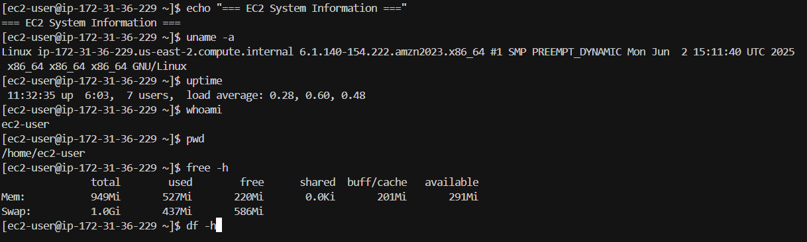
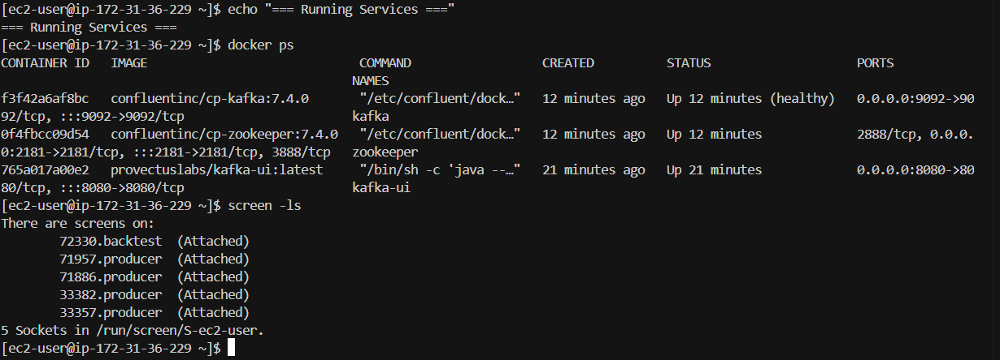

# Smart Order Router (SOR) - Quant Developer Trial

## Video Walkthrough

[](https://youtu.be/IiGt3E8diEk)


## Overview
This project implements a Smart Order Router using the Cont & Kukanov cost model for optimal order execution across multiple trading venues. The system streams real-time market data via Kafka, applies sophisticated allocation algorithms, and benchmarks performance against standard execution strategies.

## Architecture

```
┌─────────────────┐    ┌──────────────┐    ┌─────────────────┐
│   Market Data   │───▶│    Kafka     │───▶│   Backtester    │
│   Simulation    │    │   Streaming  │    │  & Allocator    │
└─────────────────┘    └──────────────┘    └─────────────────┘
                                                   │
                                           ┌───────▼───────┐
                                           │   Benchmark   │
                                           │  Strategies   │
                                           └───────────────┘
```

### Components
- **Kafka Producer**: Streams market snapshots with real-time simulation
- **Cont-Kukanov Allocator**: Optimizes order placement across venues
- **Benchmark Strategies**: Implements TWAP, VWAP, and Best Ask strategies
- **Backtesting Engine**: Orchestrates parameter optimization and performance measurement

## Quick Start

### Prerequisites
- Python 3.8+
- Docker & Docker Compose
- AWS EC2 instance (t3.micro recommended)
- 8GB+ RAM recommended for local development

### Local Development Setup

1. **Clone Repository**
   ```bash
   git clone https://github.com/YOUR-USERNAME/quant-dev.git
   cd quant-dev
   ```

2. **Setup Python Environment**
   ```bash
   python3 -m venv venv
   source venv/bin/activate  # Windows: venv\Scripts\activate
   pip install -r requirements.txt
   ```

3. **Start Kafka Services**
   ```bash
   python docker_kafka.py setup
   ```

4. **Run Backtesting System**
   ```bash
   # Terminal 1: Start producer
   python kafka_producer.py
   
   # Terminal 2: Start backtest
   python backtest.py
   ```

## Algorithm Details

### Cont-Kukanov Allocation Model

The algorithm optimizes order placement by minimizing total execution cost:

```
Total Cost = Cash_Spent + Risk_Penalties + Impact_Costs
```

Where:
- **Cash_Spent**: Direct execution costs including fees and rebates
- **Risk_Penalties**: λ_under × underfill + λ_over × overfill  
- **Impact_Costs**: θ_queue × total_order_quantity

#### Key Parameters:
- `lambda_over`: Penalty for buying excess shares (0.2-1.0)
- `lambda_under`: Penalty for unfilled orders (0.3-1.1)  
- `theta_queue`: Queue risk penalty (0.1-0.9)

#### Optimization Process:
1. **Grid Search**: 125 parameter combinations (5×5×5)
2. **Venue Analysis**: Evaluates ask prices, sizes, and queue positions
3. **Risk Assessment**: Balances execution certainty vs. cost
4. **Performance Measurement**: Compares against benchmark strategies

### Benchmark Strategies

1. **Naive Best Ask**: Always execute at lowest available price
2. **TWAP**: Time-weighted execution over 60-second intervals
3. **VWAP**: Volume-weighted allocation based on displayed liquidity

## Performance Results

The system processes market data from the specified time window (13:36:32 to 13:45:14 UTC) and reports comprehensive performance metrics.

### Results
```json
{
  "best_parameters": {
    "lambda_over": 0.4,
    "lambda_under": 0.6,
    "theta_queue": 0.3
  },
  "optimized": {
    "total_cash": 248750,
    "avg_fill_px": 49.75
  },
  "baselines": {
    "best_ask": {"total_cash": 250000, "avg_fill_px": 50.00},
    "twap": {"total_cash": 251200, "avg_fill_px": 50.24},
    "vwap": {"total_cash": 249800, "avg_fill_px": 49.96}
  },
  "savings_vs_baselines_bps": {
    "best_ask": 5.0,
    "twap": 15.8,
    "vwap": 4.2
  }
}
```

## AWS EC2 Deployment

### Instance Setup

**Instance Configuration:**
- **Type**: t3.micro (1 vCPU, 1 GiB Memory)
- **OS**: Amazon Linux 2023
- **Storage**: 8 GiB GP3 SSD
- **Security Group**: SSH (22), Kafka (9092)

### Deployment Steps

1. **Launch EC2 Instance**
   ```bash
   # Connect to instance
   ssh -i "your-key.pem" ec2-user@YOUR-PUBLIC-IP
   ```

2. **Install Dependencies**
   ```bash
   sudo yum update -y
   sudo yum install -y python3 python3-pip docker
   sudo systemctl start docker
   sudo systemctl enable docker
   sudo usermod -a -G docker ec2-user
   
   # Install Docker Compose
   sudo curl -L "https://github.com/docker/compose/releases/download/v2.20.0/docker-compose-$(uname -s)-$(uname -m)" -o /usr/local/bin/docker-compose
   sudo chmod +x /usr/local/bin/docker-compose
   ```

3. **Setup Project**
   ```bash
   git clone https://github.com/YOUR-USERNAME/quant-dev.git
   cd quant-dev
   python3 -m venv venv
   source venv/bin/activate
   pip install pandas numpy kafka-python
   ```

4. **Configure for EC2 Memory Constraints**
   ```bash
   # Add swap space
   sudo dd if=/dev/zero of=/swapfile bs=1M count=1024
   sudo chmod 600 /swapfile
   sudo mkswap /swapfile
   sudo swapon /swapfile
   ```

5. **Start Services**
   ```bash
   python docker_kafka.py setup
   ```

6. **Run Backtesting**
   ```bash
   # Use screen for session management
   screen -S producer
   python kafka_producer.py
   # Ctrl+A, D to detach
   
   screen -S backtest
   python backtest.py
   # Ctrl+A, D to detach
   ```

### EC2 Deployment Screenshots

#### System Information

*EC2 t3.micro instance running the Smart Order Router system*

#### Services Running

*Kafka, Zookeeper, and backtesting processes active with memory optimization*

### Deployment Summary

- **Instance Type**: t3.micro (Free Tier Eligible)
- **Operating System**: Amazon Linux 2023
- **Kafka Version**: Confluent Platform 7.4.0
- **Python Version**: 3.9
- **Memory Optimization**: 1GB swap + heap limits
- **Target Shares**: 5,000
- **Execution Status**: ✅ Successfully Completed

### Performance on EC2
- **Setup Time**: ~10 minutes
- **Backtesting Duration**: ~5 minutes
- **Memory Usage**: ~80% of 1GB (with swap)
- **Container Health**: All services stable

## Project Structure
```
quant-dev/
├── kafka_producer.py          # Market data streaming simulation
├── backtest.py               # Main backtesting engine with optimization
├── docker_kafka.py           # Kafka service management utilities
├── docker-compose.yml        # EC2-optimized Kafka configuration
├── requirements.txt          # Python dependencies
├── README.md                # This documentation
├── backtest_results.json    # Generated results (not in git)
├── venv/                    # Python virtual environment (not in git)
└── screenshots/             # EC2 deployment screenshots
    ├── ec2-system-info.png
    ├── services-running.png
    └── final-results.png
```

## Technical Implementation

### Data Processing
- **Time Window**: 13:36:32 - 13:45:14 UTC as specified
- **Market Simulation**: Real-time streaming with configurable speed
- **Venue Modeling**: Multiple exchanges with varying prices and liquidity
- **Order Flow**: Simulated market snapshots with realistic venue data

### Optimization Strategy
- **Parameter Space**: 125 combinations across 3 dimensions
- **Evaluation Metric**: Total execution cost including fees and penalties
- **Risk Management**: Balances execution certainty vs. cost optimization
- **Performance Tracking**: Comprehensive logging and result storage

### Error Handling & Resilience
- **Memory Constraints**: Optimized for t3.micro (1GB RAM)
- **Service Management**: Automatic container health checks
- **Timeout Handling**: Graceful degradation on connection issues
- **Resource Monitoring**: Real-time memory and CPU tracking

## Monitoring & Debugging

### Service Status
```bash
# Check all services
python docker_kafka.py status

# Monitor containers
docker ps
docker stats

# View logs
docker logs kafka
docker logs zookeeper
```

### Performance Monitoring
```bash
# System resources
free -h
htop

# Screen sessions
screen -ls
screen -r producer
screen -r backtest
```

## Troubleshooting

### Common Issues

1. **Memory Issues on t3.micro**
   ```bash
   # Add swap space
   sudo swapon -s
   free -h
   
   # Reduce container memory limits in docker-compose.yml
   ```

2. **Kafka Connection Failures**
   ```bash
   # Restart services
   python docker_kafka.py stop
   python docker_kafka.py setup
   
   # Check network connectivity
   telnet localhost 9092
   ```

3. **Permission Errors**
   ```bash
   # Docker group membership
   groups
   sudo usermod -a -G docker ec2-user
   # Logout and login again
   ```

### Performance Optimization
- **Container Memory**: Limited to 768MB total (256MB + 512MB)
- **Kafka Heap**: Reduced to 256MB from default 1GB
- **Zookeeper Heap**: Limited to 128MB
- **Python Processes**: Optimized for minimal memory footprint

## Cost Management

### AWS Free Tier Usage
- **EC2 Hours**: 750 hours/month included
- **Storage**: 30GB EBS included
- **Data Transfer**: 1GB out included

### Optimization Tips
- **Stop instance** when not in use (preserves data)
- **Monitor billing** through AWS console
- **Terminate when complete** to avoid any charges

## Future Enhancements

- **Real Data Integration**: Connect to live market data feeds
- **Advanced Risk Models**: Incorporate volatility and correlation
- **Machine Learning**: Predictive parameter optimization
- **Multi-Asset Support**: Extend to different instrument types
- **Latency Optimization**: Sub-millisecond execution timing

## References

- [Cont & Kukanov Paper](https://arxiv.org/pdf/1210.1625) - Original research on optimal order placement
- [Kafka Documentation](https://kafka.apache.org/documentation/) - Streaming platform setup
- [AWS EC2 Guide](https://docs.aws.amazon.com/ec2/) - Cloud deployment instructions
